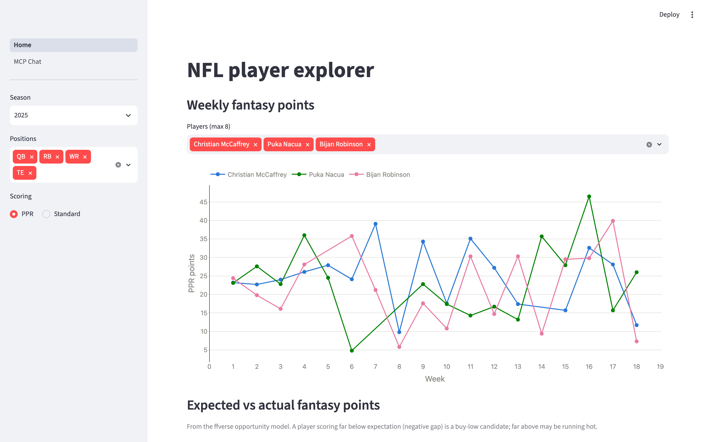

# NFL Analysis

Player analysis for both fantasy football (redraft) and real-football purposes.
Local-first: all data lives in a single DuckDB file that you can rebuild from
free sources at any time.



## Layout

```
pipeline/   Data pulls → data/nfl.duckdb
  refresh.py    nflverse: weekly stats, snap counts, schedules, injuries,
                expected fantasy points (ffverse opportunity model)
  sleeper.py    Sleeper API: player metadata + trending adds/drops
  adp.py        Fantasy Football Calculator: current-year PPR ADP
  db.py         shared DuckDB write helper
app/        Streamlit explorer UI
analysis/   Ad-hoc analysis scripts / notebooks
data/       nfl.duckdb (gitignored — rebuild with the pipeline)
```

## Setup

Requires [uv](https://docs.astral.sh/uv/). Python 3.12 is pinned via
`.python-version`.

```bash
uv sync                              # install deps into .venv
uv run python pipeline/refresh.py    # pull nflverse data (a few minutes)
uv run python pipeline/sleeper.py    # pull Sleeper data (seconds)
uv run python pipeline/adp.py        # pull FFC ADP (seconds; run after refresh.py)
uv run streamlit run app/Home.py     # open the explorer
```

`refresh.py` takes `--seasons 2023 2024 2025` to control which seasons load
(default: the last three). Re-running either script replaces its tables
wholesale, so refresh as often as you like — nflverse updates within ~24h of
games; Sleeper asks that the full player dump be pulled at most once per day.

### Automated refresh

`pipeline/refresh_all.sh` runs all three pulls in sequence, logging to
`data/refresh.log`; `--if-stale` makes it a no-op when the DB is under 20
hours old, and a lock file prevents concurrent runs. A `SessionStart` hook in
`.claude/settings.json` runs it (async, stale-gated) every time a Claude Code
session opens in this repo, so the data self-refreshes at most once a day
without any daemon or system cron. (If you clone this repo, Claude Code asks
you to approve the project's settings before any hook runs — nothing executes
automatically until you opt in.)

## Data notes

- **Join key between the two sources:** `sleeper_players.gsis_id` ↔ nflverse
  `player_id` (GSIS IDs like `00-0033873`).
- `ff_opportunity` holds expected fantasy points by week — the gap between
  expected and actual is the core buy-low/sell-high signal.
- `sleeper_trending` is a 24-hour window of the most added/dropped players
  across all Sleeper leagues — a decent proxy for waiver-wire heat.

## Poking at the data directly

```bash
uv run python -c "import duckdb; print(duckdb.connect('data/nfl.duckdb').sql('SHOW TABLES'))"
```

or start from `analysis/opportunity_gap.py` for a worked example.

## MCP Server

A local stdio MCP server exposes the NFL DuckDB dataset to Claude Code and Claude Desktop
as a set of curated conversational tools. Ask Claude questions about players, fantasy 
opportunity gaps, market trends, and injuries — the server bridges to SQL on your behalf.

**Tools:**
- `describe_data` — curated map of the schema: the columns that matter, join keys,
  scoring conventions, and the gotchas. Serves `mcp_server/semantics.md`
- `query` — read-only SQL escape hatch; runs SELECT/WITH/DESCRIBE/SHOW/SUMMARIZE, one 
  statement per call, capped at 200 rows
- `data_status` — table row counts, max season/week loaded, and DB file freshness
- `player_lookup` — fuzzy name search across nflverse and Sleeper player metadata
- `opportunity_gap` — expected vs. actual PPR fantasy points, sorted by buy-low/sell-high 
  opportunity
- `trending` — 24-hour most added/dropped players across Sleeper leagues
- `injury_report` — current-week injury status and practice participation
- `adp_value` — current FFC PPR ADP vs. last season's expected points: draft
  values, reaches, and the raw draft board

### Run the server

```bash
uv run python -m mcp_server.server
```

Runs on stdio, ready to accept JSON-RPC calls from Claude.

### Register with Claude Code

From the repo root:

```bash
claude mcp add nfl-data -- uv run python -m mcp_server.server
```

This registers the server locally so Claude Code can call its tools in the current session.

### Register with Claude Desktop

Add this to your `claude_desktop_config.json`
(`~/Library/Application Support/Claude/claude_desktop_config.json` on macOS,
`%APPDATA%\Claude\claude_desktop_config.json` on Windows):

```json
{
  "mcpServers": {
    "nfl-data": {
      "command": "/absolute/path/to/uv",
      "args": ["--directory", "/absolute/path/to/football-analyst", "run", "python", "-m", "mcp_server.server"]
    }
  }
}
```

Claude Desktop needs absolute paths: set `command` to the output of `which uv` and
`--directory` to this repo's root.
